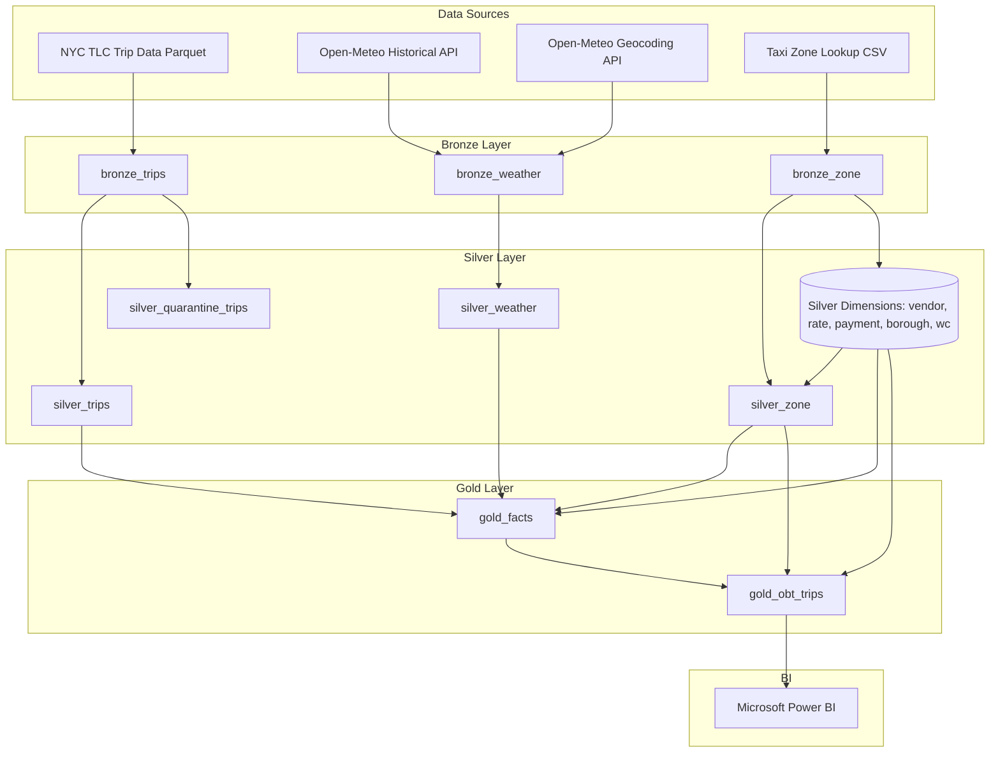
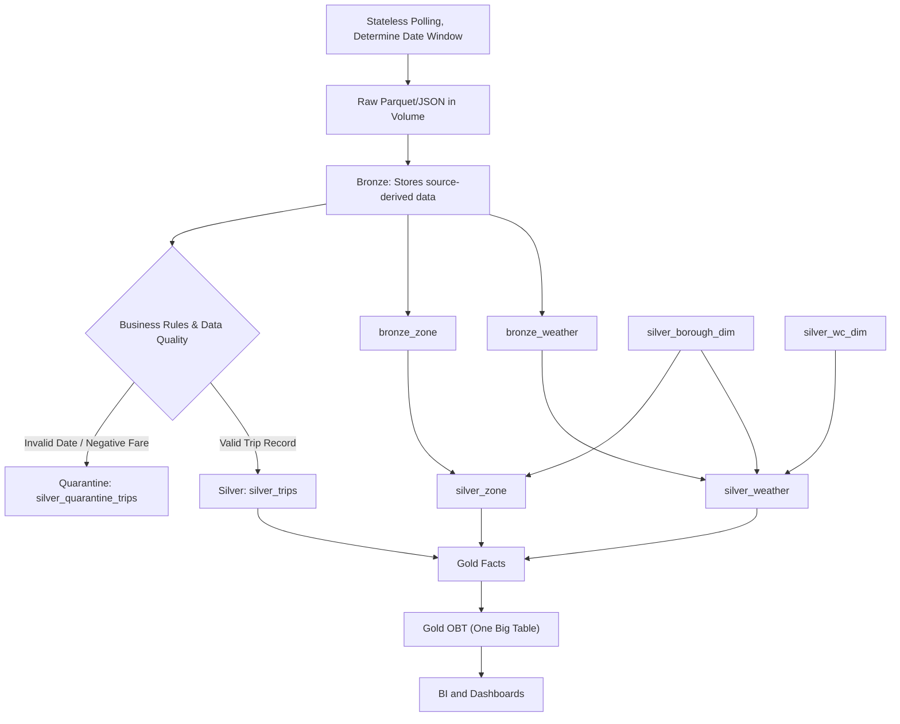
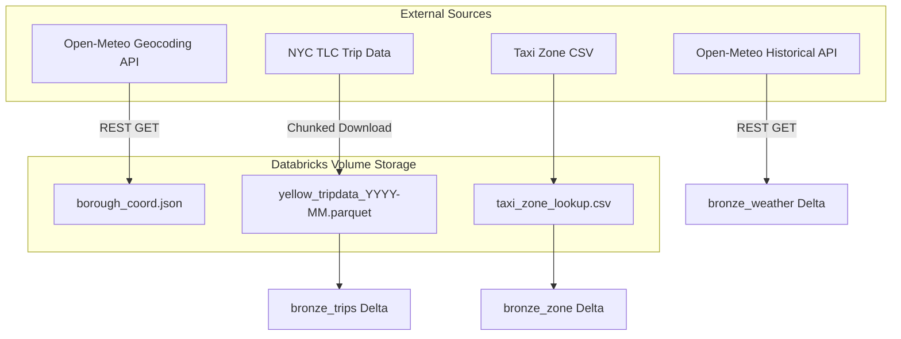
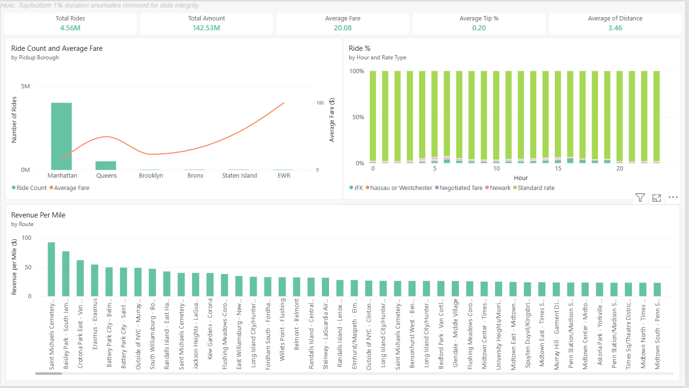

# NYC Taxi & Weather Data Pipeline

An end-to-end data pipeline built on Databricks that processes NYC TLC taxi trip data and Open-Meteo historical weather data through a Medallion architecture (Bronze, Silver, Gold) to support analytics and visualization in Microsoft Power BI.

## Project Highlights

This pipeline implements several data engineering patterns to ensure reliability, performance, and analytical flexibility:

- **Rolling Window Ingestion:** Scans the Volume for the latest available TLC month, downloads the next month when published, and removes the oldest local month to maintain the working data window.
- **Dual Gold Layer Modeling:** Materializes both a normalized Schema (`gold_facts`) and a  denormalized BI-serving table (`gold_obt_trips`) that reduces the number of joins required in the reporting layer.
- **Optimized Data Quality Gates:** DQ checks use anti-joins for referential-integrity validation; small dimension/reference tables are broadcast during Silver/Gold transformations.
- **Explicit Silver Quarantine Pattern:** Utilizes PySpark's `when().otherwise()` logic to evaluate business rules, routing valid records to `silver_trips` while explicitly isolating invalid records (e.g., negative fares, impossible dates) into `silver_quarantine_trips` to preserve rejected records and rejection reasons for the processed window.

## Architecture

The pipeline processes data from raw sources to business-ready tables using a layered Databricks Medallion architecture. 
### Platform Architecture

 
### Medallion Data Flow

### Data Ingestion Workflow

## Data Sources

The project integrates three primary data domains:

| **Dataset**                        | **Source**     | **Format**          | **Key Fields**                                                                         | **Purpose**                                                                              |
| ---------------------------------- | -------------- | ------------------- | -------------------------------------------------------------------------------------- | ---------------------------------------------------------------------------------------- |
| **NYC TLC Yellow Taxi Trip Datas** | NYC TLC        | `.parquet` (Volume) | `tpep_pickup_datetime`, `PULocationID`, `DOLocationID`, `fare_amount`, `trip_distance` | Core fact data representing individual taxi rides.                                       |
| **NYC TLC Taxi Zone Lookup**       | NYC TLC        | `.csv` (Volume)     | `LocationID`, `Borough`, `Zone`, `service_zone`                                        | Spatial lookup to map Location IDs to Boroughs and Zones.                                |
| **Historical Weather**             | Open-Meteo API | JSON / REST         | `temperature_2m`, `precipitation`, `snowfall`, `weather_code`                          | Hourly weather for five NYC boroughs plus EWR, represented by one coordinate per region. |

## Data Pipeline Steps

The pipeline is orchestrated via sequential PySpark notebooks across the Medallion architecture:

1. **Bronze Ingestion (`01_Bronze`)**:
	- Calculates the next target month dynamically and downloads new TLC `.parquet` chunks into the Databricks Volume, dropping the oldest month to maintain the rolling window.
	    
	- Fetches spatial coordinates for five NYC boroughs (Queens, Bronx, Manhattan, Staten Island, Brooklyn) plus EWR via Open-Meteo's Geocoding API.
	    
	- Retrieves hourly weather data covering the pipeline's calculated trip-data date window, including an additional month after the latest trip month to account for trailing drop-offs. Weather is represented at a borough level rather than at the individual taxi pickup location.

1. **Silver Transformations (`02_Silver`)**:
	- Materializes hardcoded dimension tables (Weather Codes, Borough IDs, Payment Types, Vendor IDs, Rate Codes).
	    
	- Cleanses `bronze_zone` using `silver_borough_dim`, and cleanses `bronze_weather` using both `silver_borough_dim` and `silver_wc_dim`, broadcasting smaller dimension tables during joins to optimize Spark performance.
	    
	- Evaluates trip data against business rules and routes records to `silver_trips` (valid) or `silver_quarantine_trips` (invalid).
	
2. **Data Quality Validation (`02_Silver/03_run_dqcs.ipynb`)**:
    
	- Executes 18 automated SQL-based data quality checks (e.g., duplicate IDs, null datetimes, unknown reference IDs).
        
    - Halts pipeline execution (`RuntimeError`) if any invalid rows bypass the Silver transformations.
        
3. **Gold Layer Build (`03_Gold`)**:
    
    - Builds the `gold_facts` table by joining trips with geographic and historical weather data at the `pickup_datehour` and `borough_id` granularity.
        
    - Generates the denormalized `gold_obt_trips` view, fully resolving all string descriptions for immediate BI consumption.
        

_Databricks automated workflow execution orchestrating the Bronze, Silver, and Gold tasks._

## Data Transformation Details

The pipeline handles Several key transformations to ensure data integrity:

- **Timezone Alignment:** Weather data timestamps are adjusted by `- 1 HOUR` (`interval 1 hour`) to correctly align with localized taxi pickup hours.

- **Missing Value Imputation:** Fills nulls with `0` for nullable fields (`passenger_count`, `Airport_fee`, `congestion_surcharge, store_and_fwd_flag`) , normalize (`Unknown, N/A`) as `Unknown`for categorical flags (`Borough, Zone, service_zone`)  and other fields are handled differently. `RatecodeID` becomes `99.
    
- **Date Truncation:** Derives `pickup_datehour` and `dropoff_datehour` by truncating precise timestamps to the hour for accurate joining with hourly weather metrics.
    
- **Business Rule Quarantining:** Explicitly tags records where drop-off precedes pick-up, trip distances are `<= 0`, fares are `<= 0`, or pickup dates outside the active pipeline window.
    

## Taxi + Weather Analysis & Insights

The Gold layer datasets connect to Microsoft Power BI to explore relationships between weather events, geographic locations, and taxi demand.

### Dashboards & Key Visuals

_High-level executive summary displaying total trips, revenue metrics, and baseline operational health._

_Assessing trip volume fluctuations and demand shifts during varied precipitation, snowfall, and temperature conditions._

_Analyzing geographic profitability, isolating which inter-borough routes generate the highest revenue per mile._

_Exploring how factors like trip distance, weather conditions, and payment types influence average tipping percentages._

_Geographic breakdown of total volume and average fare amounts originating from each NYC borough._

## Data Quality / Validation

The pipeline implements an validation framework in `03_run_dqcs.ipynb` that acts as a circuit breaker before Gold materialization. Validation checks include:

- **Null Checks:** Validates absence of nulls in `VendorID`, `RatecodeID`, `payment_type`, and geographic `LocationID`s.
    
- **Referential Integrity:** Confirms all foreign keys in the trips and weather tables map successfully to the established Silver dimensions.
    
- **Logical Consistency:** Flags rows where `tpep_dropoff_datetime` < `tpep_pickup_datetime`.
    
- **Duplicate Checks:** Aggregates and verifies uniqueness for location IDs and hourly borough weather records.

## Technologies Used

| Category         | Technology                                                   |
| ---------------- | ------------------------------------------------------------ |
| Data Processing  | Python, PySpark                                              |
| Storage & Format | Delta Lake, Parquet, DBFS (Databricks File System) / Volumes |
| Data Ingestion   | Open-Meteo REST APIs, `requests`, `glob`                     |
| Visualization    | Microsoft Power BI                                           |
| Architecture     | Medallion (Bronze/Silver/Gold), One Big Table (OBT)          |
| Platform         | Databricks                                                   |
## Repository Structure

taxi_weather_pipeline/
├── .gitignore
├── 01_Bronze/
│   ├── 00_ingest_new_month.ipynb
│   ├── 01_ingest_borough_coords.ipynb
│   ├── 02_ingest_trips_zones.ipynb
│   └── 03_ingest_weather_api.ipynb
│
├── 02_Silver/
│   ├── 01_create_silver_dims.ipynb
│   ├── 02_transform_silver.ipynb
│   ├── 03_run_dqcs.ipynb
│   ├── 03a_dqc_trips.dbquery.ipynb
│   ├── 03b_dqc_weather.dbquery.ipynb
│   └── 03c_dqc_zone.dbquery.ipynb
│
├── 03_Gold/
│   └── 01_build_gold_layer.ipynb
│
├── docs/
│   ├── adr/
│   │   ├── 001-stateless-ingestion.md
│   │   ├── 002-optimized-data-quality-gates.md
│   │   ├── 003-dual-gold-layer-modeling.md
│   │   └── 004-silver-quarantine-pattern.md
│   └── analytics/
│       └── BI images
│
└── intial_datasets/
    ├── taxi_zone_lookup.csv
    ├── yellow_tripdata_2026-05.parquet
    ├── yellow_tripdata_2026-06.parquet
    └── yellow_tripdata_2026-07.parquet

