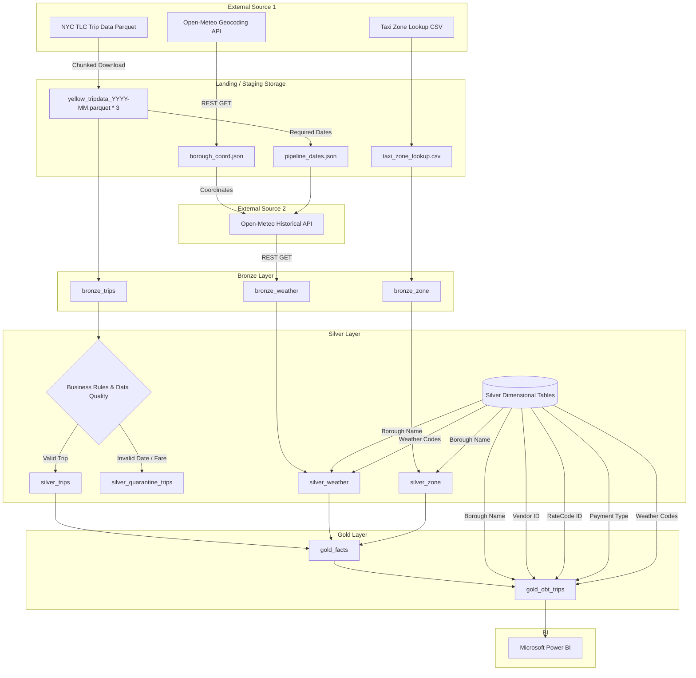
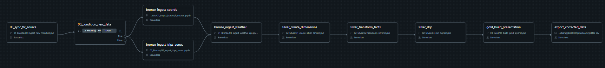
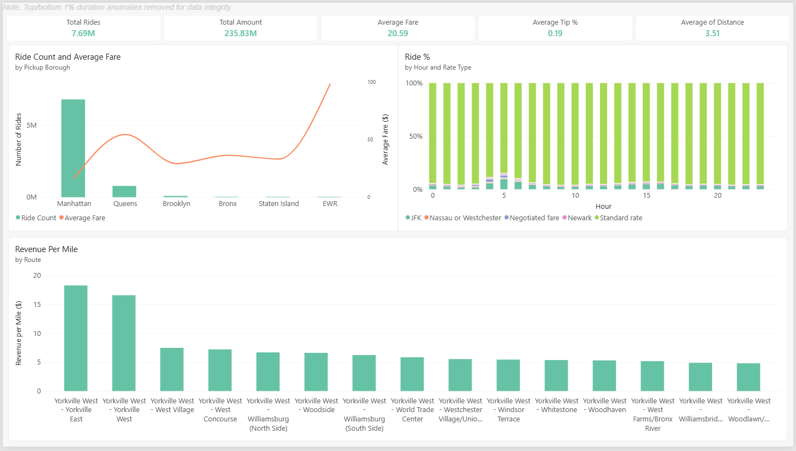
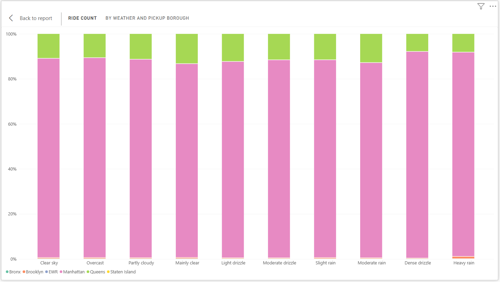
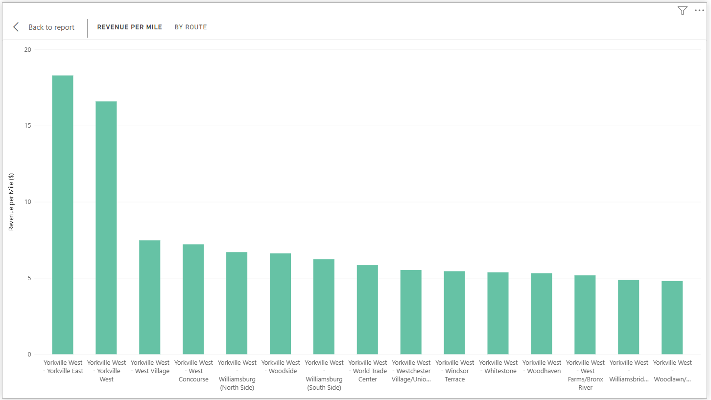
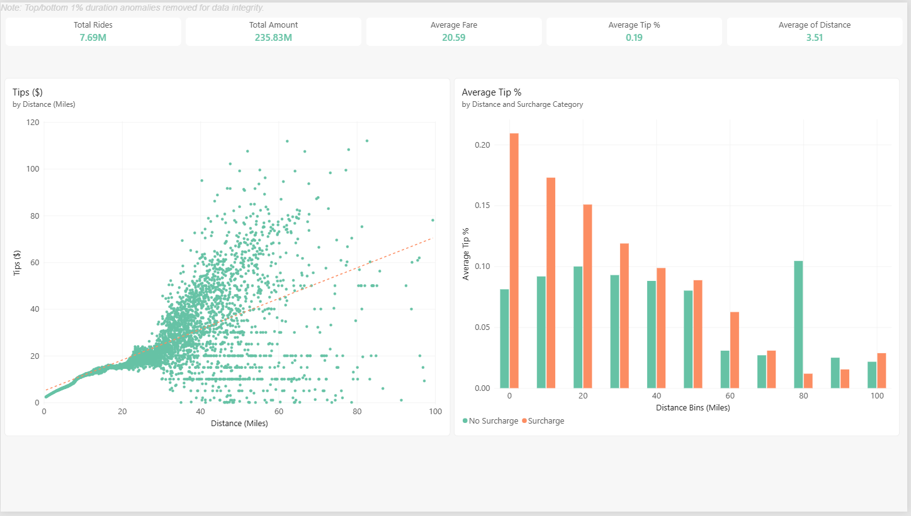
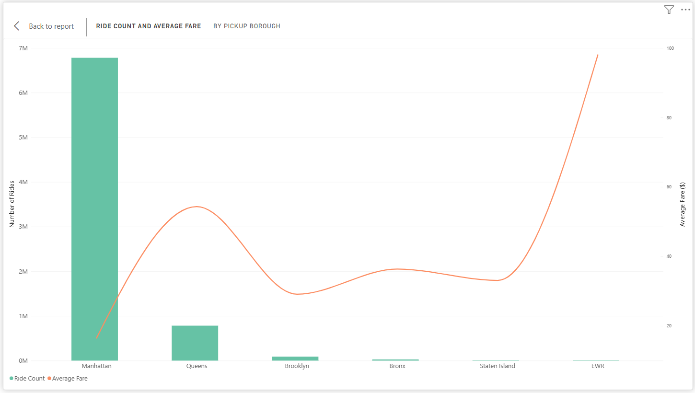

# NYC Taxi & Weather Data Pipeline

An end-to-end data pipeline built on Databricks that processes NYC TLC taxi trip data and Open-Meteo historical weather data through a Medallion architecture (Bronze, Silver, Gold) to support analytics and visualization in Microsoft Power BI.

## Project Highlights

This pipeline implements several data engineering patterns to ensure reliability, performance, and analytical flexibility:

- **Rolling Window Ingestion:** Scans the Volume for the latest available TLC month, downloads the next month when published, and removes the oldest local month to maintain the working data window.
- **Dual Gold Layer Modeling:** Materializes a trip-level fact table (`gold_facts`) and a denormalized BI-serving table (`gold_obt_trips`) that reduces the number of joins required in the reporting layer.
- **Data Quality Gates & Join Optimization:** DQ checks use anti-joins for referential-integrity validation; small dimension/reference tables are broadcast during Silver/Gold transformations.
- **Explicit Silver Quarantine Pattern:** Utilizes PySpark's `when().otherwise()` logic to evaluate business rules, routing valid records to `silver_trips` while explicitly isolating invalid records (e.g., negative fares, impossible dates, zero passengers) into `silver_quarantine_trips` to preserve rejected records and rejection reasons for the processed window.

## Architecture

The pipeline processes data from raw sources to business-ready tables using a layered Databricks Medallion architecture. 
### Platform Architecture




## Data Sources

The project integrates three primary data domains:

| **Dataset**                        | **Source**     | **Format**          | **Key Fields**                                                                         | **Purpose**                                                                              |
| ---------------------------------- | -------------- | ------------------- | -------------------------------------------------------------------------------------- | ---------------------------------------------------------------------------------------- |
| **NYC TLC Yellow Taxi Trip Datas** | NYC TLC        | `.parquet` (Volume) | `tpep_pickup_datetime`, `PULocationID`, `DOLocationID`, `fare_amount`, `trip_distance` | Core fact data representing individual taxi rides.                                       |
| **NYC TLC Taxi Zone Lookup**       | NYC TLC        | `.csv` (Volume)     | `LocationID`, `Borough`, `Zone`, `service_zone`                                        | Spatial lookup to map Location IDs to Boroughs and Zones.                                |
| **Borough Coordinates**             | Open-Meteo Geocoding API | .json (Volume)         | `latitude`, `longitude`| Provides representative geographic coordinates for five NYC boroughs plus EWR, used to query the Historical Weather API. |
| **Historical Weather**             | Open-Meteo API | JSON / REST         | `temperature_2m`, `precipitation`, `snowfall`, `weather_code`                          | Hourly weather for five NYC boroughs plus EWR, represented by one coordinate per region. |

## Dataset Grain

Understanding the granularity of the tables is critical for downstream BI joining and metric aggregation:


| Dataset | Grain |
| :--- | :--- |
| **silver_trips** | One valid TLC taxi trip. |
| **silver_weather** | One geographic region per hour (five NYC boroughs + EWR). |
| **silver_zone** | One NYC TLC Taxi Zone (LocationID). |
| **gold_facts** | One valid taxi trip enriched with pickup-region hourly weather. |
| **gold_obt_trips** | One fully denormalized valid taxi trip. |


## Data Pipeline Steps

The pipeline is orchestrated via sequential PySpark notebooks across the Medallion architecture:

1. **Bronze Ingestion (`01_Bronze`)**:
	- Calculates the next target month dynamically and downloads new TLC `.parquet` chunks into the Databricks Volume, dropping the oldest month to maintain the rolling window.
	    
	- Fetches spatial coordinates for five NYC boroughs (Queens, Bronx, Manhattan, Staten Island, Brooklyn) plus EWR via Open-Meteo's Geocoding API.
	    
	- Retrieves hourly weather data covering the pipeline's calculated trip-data date window, including an additional month after the latest trip month to account for trailing drop-offs. Weather is represented at a geographic-region level rather than at the individual taxi pickup location.

2. **Silver Transformations (`02_Silver`)**:
	- Materializes hardcoded dimension tables (Weather Codes, Borough IDs, Payment Types, Vendor IDs, Rate Codes).
	    
	- Cleanses `bronze_zone` using `silver_borough_dim`, and cleanses `bronze_weather` using both `silver_borough_dim` and `silver_wc_dim`, broadcasting smaller dimension tables during joins to optimize Spark performance.
	    
	- Evaluates trip data against business rules and routes records to `silver_trips` (valid) or `silver_quarantine_trips` (invalid).
	
3. **Data Quality Validation (`02_Silver/03_run_dqcs.ipynb`)**:
    
	- Executes 18 automated SQL-based data quality checks (e.g., duplicate reference records, null datetimes, unknown reference IDs).
        
    - Halts execution with `RuntimeError` if any configured DQ check returns invalid records in the Silver datasets.
        
4. **Gold Layer Build (`03_Gold`)**:
    
    - Builds the `gold_facts` table by joining trips with geographic and historical weather data at the `pickup_datehour` and `borough_id` granularity.
        
    - Generates the denormalized `gold_obt_trips` Delta table, resolving coded attributes and geographic descriptions for BI consumption.
        
**Databricks Jobs:** The notebooks are configured as a sequential Databricks workflow in the workspace; the Job configuration is not exported to this repository.

## Pipeline Orchestration

The notebooks are configured as sequential tasks in a Databricks Job in the workspace.


The workflow follows this dependency order:

```
Bronze Ingestion
      │
      ▼
Silver Dimensions
      │
      ▼
Silver Transformations
      │
      ▼
Data Quality Validation
      │
      ▼
Gold Layer Build

Gold Layer
    │
    ▼
Power BI
```

The Bronze tasks prepare the rolling TLC data, geographic coordinates, taxi-zone reference data, and hourly weather data. Silver transformations then create the cleaned datasets and quarantine invalid trip records.

The Data Quality Validation task executes the configured SQL checks and raises a `RuntimeError` when a check returns invalid records. A failed DQ task therefore prevents the downstream Gold task from completing in the sequential workflow.

The Databricks Job configuration is maintained in the Databricks workspace and is not exported to this repository.

## Data Transformation Details

The pipeline applies several key transformations to prepare the Silver and Gold datasets:

- **Weather Transformation:** Casts weather `timestamps` to `timestamp_ntz` and uses a window function to shift precipitation and snowfall values to the subsequent hourly record within each region.

- **Missing Value Handling:** Fills null (`Airport_fee, congestion_surcharge`) values with 0; maps missing store_and_fwd_flag to `Unknown`; and maps missing `RatecodeID` to 99. Zone reference values of `N/A` are normalized to `Unknown`.
   
- **Date Truncation:** Derives `pickup_datehour` and `dropoff_datehour` by truncating precise timestamps to the hour for accurate joining with hourly weather metrics.
    
Business Rule Quarantining: Routes trips to quarantine when pickup timestamps fall outside the active window, pickup time is greater than or equal to drop-off time, trip distance or fare is non-positive, passenger count is zero or null, or `extra` is negative.
    

## Pipeline Limitations & Design Choices

The following design decisions constraint the scope and operation of the pipeline:
- **Batch Overwrite Pattern:** Bronze trips, Bronze weather, Silver tables, Quarantine, and Gold tables are strictly written using overwrite mode. While file ingestion represents net-new monthly data, downstream tables are rebuilt entirely for the active window. This is a batch-oriented pipeline, not a streaming or incrementally updated architecture.
- **3-Month Rolling Window:** The pipeline is designed to maintain a three-month working window, adding the next available month and removing the oldest month when new data is published.
- **Spatial Granularity:** Weather is represented using one coordinate pair per geographic region: five NYC boroughs plus EWR (6 regions).
- **Temporal Granularity:** Weather conditions are joined at the pickup_borough_id and truncated pickup_datehour level. There is no exact coordinate-level or minute-level weather matching due to disparities in the source datasets.

## Taxi + Weather Analysis & Insights

The Gold layer datasets connect to Microsoft Power BI to explore relationships between weather events, geographic locations, and taxi demand.

### Dashboards & Key Visuals

Dashboard Note: Dashboard metrics exclude the top and bottom 1% of trip-duration values to reduce the influence of extreme trip-duration outliers.

The visuals below highlight key dashboard components and do not reflect every analytical output in the full project.

High-level executive summary displaying total trips, revenue metrics, and baseline operational health.


Assessing trip volume fluctuations and demand shifts during varied precipitation, snowfall, and temperature conditions.


Analyzing geographic profitability, isolating which inter-borough routes generate top 15 highest revenue per mile.


Exploring how factors like trip distance, weather conditions, and payment types influence average tipping percentages.


Geographic breakdown of total volume and average fare amounts originating from each NYC borough.


## Data Quality / Validation

The pipeline implements a validation framework in `03_run_dqcs.ipynb` that acts as a circuit breaker before Gold materialization. Validation checks include:

- **Null Checks:** Validates required trip fields, location IDs, and weather timestamps are not null.
    
- **Referential Integrity:** Validates that configured trip and weather reference fields map to their corresponding Silver reference tables.
    
- **Logical Consistency:** Flags rows where `tpep_dropoff_datetime` < `tpep_pickup_datetime`.
    
- **Duplicate Checks:** Validates uniqueness of taxi-zone reference records and hourly weather records.

## Technologies Used

| Category         | Technology                                                   |
| ---------------- | ------------------------------------------------------------ |
| Data Processing  | Python, PySpark                                              |
| Storage & Format | Delta Lake, Parquet, DBFS (Databricks File System) / Volumes |
| Data Ingestion   | Open-Meteo REST APIs, `requests`, `glob`                     |
| Visualization    | Microsoft Power BI                                           |
| Architecture     | Medallion (Bronze/Silver/Gold), One Big Table (OBT)          |
| Platform         | Databricks                                                   |


## Setup / Execution

The pipeline is designed to run in a Databricks environment and uses a Unity Catalog Volume for source-file storage.

### Prerequisites

* Databricks workspace with permission to run Python/PySpark notebooks and access Unity Catalog Volumes.
* Outbound internet access for the NYC TLC download and Open-Meteo APIs.
* Microsoft Power BI Desktop for the optional BI layer.

### Initial Setup

1. Import the notebooks from this repository into the Databricks workspace.

2. Create or configure the dataset Volume expected by the notebooks:

   `/Volumes/workspace/taxi_weather/datasets/`

3. Copy the initial TLC and taxi-zone files from `intial_datasets/` into the Volume.The included initial dataset contains three TLC monthly files; the rolling-ingestion notebook expects the existing trip files to follow the yellow_tripdata_YYYY-MM.parquet naming convention.

4. Ensure the `workspace.taxi_weather` catalog/schema is available for the Delta tables created by the pipeline.

### Execution Order

Run the notebooks in dependency order:

```text
01_Bronze/
├── 00_ingest_new_month.ipynb
├── 01_ingest_borough_coords.ipynb
├── 02_ingest_trips_zones.ipynb
└── 03_ingest_weather_api.ipynb

02_Silver/
├── 01_create_silver_dims.ipynb
├── 02_transform_silver.ipynb
└── 03_run_dqcs.ipynb

03_Gold/
└── 01_build_gold_layer.ipynb
```

The first Bronze notebook determines whether a new TLC month is available and updates the rolling source-data window. The remaining Bronze notebooks prepare the coordinate, trip, zone, and weather inputs required by the Silver layer.

The Silver notebooks create reference dimensions, transform the source data, quarantine invalid trip records, and run the automated DQ checks.

The Gold notebook runs only after the Silver transformations and DQ validation have completed successfully.

### Power BI

The denormalized Gold table is the primary BI-facing dataset:

`workspace.taxi_weather.gold_obt_trips`

Power BI can use this table as the reporting source for the dashboards included in the project.


## Repository Structure
```
taxi_weather_pipeline/
├── .gitignore  
├── 01_Bronze/
│   ├── 00_ingest_new_month.ipynb
│   ├── 01_ingest_borough_coords.ipynb
│   ├── 02_ingest_trips_zones.ipynb
│   └── 03_ingest_weather_api.ipynb
├── 02_Silver/
│   ├── 01_create_silver_dims.ipynb
│   ├── 02_transform_silver.ipynb
│   ├── 03_run_dqcs.ipynb
│   ├── 03a_dqc_trips.dbquery.ipynb
│   ├── 03b_dqc_weather.dbquery.ipynb
│   └── 03c_dqc_zone.dbquery.ipynb
├── 03_Gold/
│   └── 01_build_gold_layer.ipynb
├── docs/
│   ├── adr/
│   │   ├── 001-stateless-ingestion.md
│   │   ├── 002-optimized-data-quality-gates.md
│   │   ├── 003-dual-gold-layer-modeling.md
│   │   └── 004-silver-quarantine-pattern.md
│   └── images/
│       ├── Average_Tip_%_by_Distance_and_Surcharge_Category.png
│       ├── Average_Tip%_by_Precipitation_and_Temperature.png
│       ├── Driver_Tipping&Friction.png
│       ├── Executive_Overview.png
│       ├── Revenue_Per_Mile_by_Route.png
│       ├── Ride_%_by_Hour_and_Rate_Type..png
│       ├── Ride_Count_and_Average_Fares_by_Borough.png
│       ├── Ride_Count_by_Weather_and_Borough.png
│       ├── The_Weather_Impact.png
│       └── Tips_vs_Distance.png
├── intial_datasets/
│   ├── taxi_zone_lookup.csv
│   ├── yellow_tripdata_2026-05.parquet
│   ├── yellow_tripdata_2026-06.parquet
│   └── yellow_tripdata_2026-07.parquet
└── README.md
```
